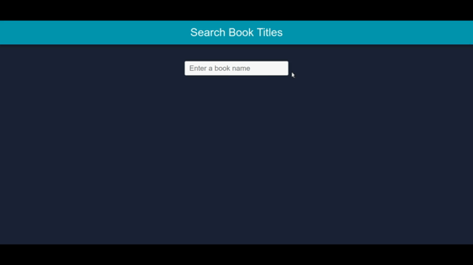

# React Infinite Scroll - Books Title Search

Simple React book search app with infinite scroll functionality. Infinite scroll is when you reach the end of content or page, app loads more data from API, similar to instagram, facebook, youtube scroll.  [Live Demo](https://react-book-search.netlify.com/)




## Introduction

It is a practice project to learn infinite scroll functionality and apply other react features. It uses custom webpack configuration instead of prebuilt create-react-app.


__Commands to run the project on local machine__

```bash
$ npm install
$ npm start
```


### Features

- Infinite scroll implementation
- Uses React functional components with basic and advance hooks (useRef, useCallback)
- Custom hooks are made to keep the code DRY
- Custom Webpack configuration with split chunks
- Styled-components library for styling and animation 
- Open library API to get book titles

### Technologies

- React 16.12+
- Styled-Components
- Webpack
- Axios


